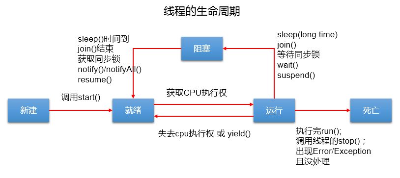

# 多线程

## 程序、进程、线程的理解

* 程序：是为完成特定任务、用某种语言编写的一组指令的集合。即指一段静态的代码。
* 进程：程序的一次执行过程，或是正在运行的一个程序。
* 线程：进程可进一步细化为线程，是一个程序内部的一条执行路径。

## 并行与并发

* 并行：多个CPU同时执行多个任务。比如：多个人同时做不同的事。
* 并发：一个CPU(采用时间片)同时执行多个任务。比如：秒杀、多个人做同一件事

## 创建多线程的两种方法

1. 方式一：继承Thread类的方式：
   1. 创建一个继承于Thread类的子类
   2. 重写Thread类的run() --> 将此线程执行的操作声明在run()中
   3. 创建Thread类的子类的对象
   4. 通过此对象调用start()：①启动当前线程 ② 调用当前线程的run()

   * 示例：

2.  方式二：实现Runnable接口的方式：
   1. 创建一个实现了Runnable接口的类
   2. 实现类去实现Runnable中的抽象方法：run()
   3. 创建实现类的对象
   4. 将此对象作为参数传递到Thread类的构造器中，创建Thread类的对象
   5. 通过Thread类的对象调用start()

   * 示例：

3. 两种方式的对比：
   * 开发中：优先选择：实现Runnable接口的方式
        1. 实现的方式没有类的单继承性的局限性。
        2. 实现的方式更适合来处理多个线程共享数据的情况。
   * 联系：public class Thread implements Runnable
   * 相同点：两种方式都需要重写run(),将线程要执行的逻辑声明在run()中。目前两种方式，要想启动线程，都是调用的Thread类中的start()。

## Thread类中的常用方法

* Thread类中的常用的方法:
  * void start()：启动当前线程；调用当前线程的run()
  * void run()：通常需要重写Thread类中的此方法，将创建的线程要执行的操作声明在此方法中
  * static Thread currentThread()：静态方法，返回执行当前代码的线程
  * String getName()：获取当前线程的名字
  * void setName()：设置当前线程的名字
  * static void yield()：释放当前cpu的执行权
  * void join():在线程a中调用线程b的join(),此时线程a就进入阻塞状态，直到线程b完全执行完以后，线程a才结束阻塞状态。
  * void stop()：已过时。当执行此方法时，强制结束当前线程。
  * static void sleep(long millitime)：让当前线程“睡眠”指定的millitime毫秒。在指定的millitime毫秒时间内，当前线程是阻塞状态。
  * boolean isAlive()：判断当前线程是否存活

* 线程优先级：
  * MAX_PRIORITY：10
  * MIN _PRIORITY：1
  * NORM_PRIORITY：5  -->默认优先级
* 如何获取和设置当前线程的优先级：
  *   int getPriority()：获取线程的优先级
  *   void setPriority(int newPriority)：设置线程的优先级
* 线程优先级说明：
  * 高优先级的线程要抢占低优先级线程cpu的执行权。但是只是从概率上讲，高优先级的线程高概率的情况下被执行。并不意味着只当高优先级的线程执行完以后，低优先级的线程才执行。
* 示例：

## Thread类的生命周期

## 线程同步

1. 方式一：同步代码块

2. 方式二：同步方法

3. 方式三：Lock锁  --- JDK5.0新增

