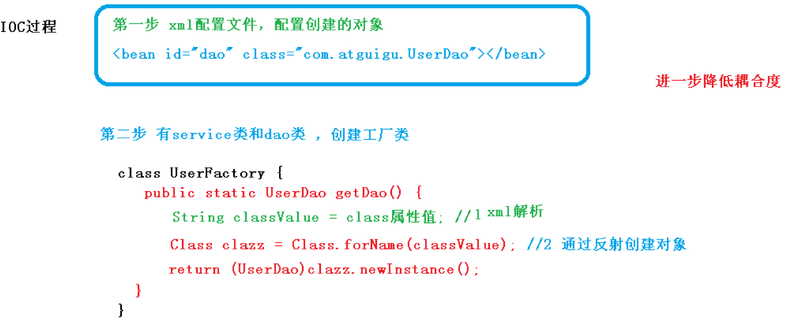
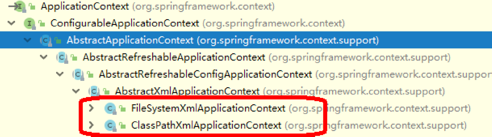

# IOC

1. IOC概念底层原理
2. IOC接口（BeanFactory）
3. IOC操作——Bean管理（基于xml）
4. IOC操作——Bean管理（基于注解）


## IOC概念底层原理

### 概念

1. 控制反转，把对象创建和对象之间的调用过程，交给Spring进行管理
2. 使用IOC的目的：为了将耦合度降低
3. 入门案例就是通过IOC实现的


### 底层原理

IOC通过xml解析、工厂模式、反射实现现有功能


### 画图讲解IOC底层原理

1. 在xml配置文件中配置要创建的java对象
2. 创建工厂类
3. 在工厂类中解析xml文件，获取java对象中的class属性值
4. 通过反射获取java对象的class
5. 返回通过反射获取的java对象




## IOC接口（BeanFactory）

1. IOC思想基于IOC容器完成，IOC容器底层就是对象工厂

2. Spring提供IOC容器实现两种方式：（两个接口）

   1. BeanFactory：IOC容器基本实现，是Spring内部的使用接口，不提供开发人员进行使用。
      - 加载配置文件时候不会创建对象，在获取对象（使用）才去创建对象
   2. ApplicationContext：BeanFactory接口的子接口，提供更多更强大的功能，一般由开发人
      员进行使用。
      - 加载配置文件时候就会把在配置文件对象进行创建

3. ApplicationContext接口的实现类

   - FileSystemXmlApplicationContext：以传入文件路径的形式加载xml配置文件
   - ClassPathXmlApplicationContext：以class的形式加载配置文件，当xml文件在src目录下使用这种方式。

   


## IOC操作——Bean管理（基于xml）

### 基于xml方式创建对象

1. 在spring配置文件中，使用bean标签，标签里面添加对应属性，就可以实现对象创建。
2. 在bean标签有很多属性，介绍常用的属性
   - id：表示类的别名，是唯一标识
   - class：类的全路径
3. 创建对象时，默认执行无参数构造方法完成对象创建。


### 基于xml方式注入属性

DI：依赖注入，就是注入属性。

注入属性有两种方式：

1. 使用set方法进行注入
2. 使用有参构造方法进行注入


### 使用set方法注入属性

1. 实现步骤：

   1. 创建类，定义属性和对应的set方法
   2. 在spring配置文件中添加要创建的类，并配置**property**标签
      - property标签中的属性：
        - name：java类中定义的属性名
        - value：向属性中注入的值
   3. 在测试类中加载配置文件，获取对象

2. 示例：

   ```java
   public class Book {
       private String bname;
       private String bauther;
   
       public void setBname(String bname) {
           this.bname = bname;
       }
   
       public void setBauther(String bauther) {
           this.bauther = bauther;
       }
   
       public void show() {
           System.out.println(bname + "--" + bauther);
       }
   }
   ```

   ```xml
       <!--配置Book类-->
       <bean id="book" class="com.atguigu.spring.Book">
           <property name="bname" value="易筋经"></property>
           <property name="bauther" value="达摩祖师"></property>
       </bean>
   ```

   ```java
       @Test
       public void test2() {
           //加载xml文件
           ApplicationContext context = new ClassPathXmlApplicationContext("bean1.xml");
           //获取配置对象
           Book book = context.getBean("book", Book.class);
           //调用方法
           System.out.println(book);
           book.show();
       }
   ```

   

### 使用构造函数注入属性

1. 实现步骤：

   1. 创建类，定义属性和对应的有参构造方法
   2. 在spring配置文件中添加要创建的类，并配置**constructor-arg**标签
      - constructor-arg标签中的属性：
        - name：java类中定义的属性名
        - index：构造方法中的第几个参数
        - value：向属性中注入的值
   3. 在测试类中加载配置文件，获取对象

2. 代码示例：

   ```java
   public class Order {
       private String oname;
       private String address;
   
       public Order(String oname, String address) {
           this.oname = oname;
           this.address = address;
       }
       
       public void show(){
           System.out.println(oname + "--" + address);
       }
   }
   ```

   ```xml
       <!--配置Order类-->
       <bean id="order" class="com.atguigu.spring.Order">
           <constructor-arg name="oname" value="computer"></constructor-arg>
           <constructor-arg name="address" value="China"></constructor-arg>
           <!--<constructor-arg index="0" value="computer"></constructor-arg>-->
       </bean>
   ```

   ```java
       @Test
       public void test3() {
           //加载xml文件
           ApplicationContext context = new ClassPathXmlApplicationContext("bean1.xml");
           //获取配置对象
           Order order = context.getBean("order", Order.class);
           //调用方法
           System.out.println(order);
           order.show();
       }
   ```


## IOC操作——Bean管理（通过XML注入其他类型属性）

### 字面量

字面量是指在创建类或初始化类对象过程中传入的属性值。

1. null值

   ```xml
           <!--配置null值-->
           <property name="baddress">
               <null />
           </property>
   ```

2. 属性值中包含特殊符号

   ```xml
           <!--配置特殊符号-->
   		<!--
   			1. 把<>进行转义，&lt;&gt;
   			2. 把带特殊符号的内容写到CDATA里
   		-->
           <property name="baddress">
               <value><![CDATA[<<南京>>]]></value>
           </property>
   ```

   

### 外部Bean

1. 实现步骤

   1. 创建两个类service和dao
   2. 在service中创建dao类型属性，并生成set方法
   3. 在spring配置文件中配置创建service和dao对象，并将dao的id属性值传入到service的bean标签中。
   4. 在测试方法中加载配置文件，获取对象

2. 代码示例：

   ```java
   public class UserService {
   
       //设置UserDao属性
       private UserDao userDao;
   
       //设置set方法
       public void setUserDao(UserDao userDao) {
           this.userDao = userDao;
       }
   
       //调用UserDao中的方法
       public void update() {
           System.out.println("UserService......");
           userDao.show();
       }
   }
   ```

   ```xml
       <!--创建service和dao对象-->
       <bean name="userService" class="com.atguigu.spring.service.UserService">
           <!--
               设置属性值：
               name：类里面属性名称
               ref：创建userDao对象bean标签的id值
           -->
           <property name="userDao" ref="userDaoImpl"></property>
       </bean>
       <bean name="userDaoImpl" class="com.atguigu.spring.dao.impl.UserDaoImpl"></bean>
   ```

   ```java
       @Test
       public void test4() {
           //加载xml文件
           ApplicationContext context = new ClassPathXmlApplicationContext("bean2.xml");
           //获取配置对象
           UserService userService = context.getBean("userService", UserService.class);
           System.out.println(userService);
           userService.update();
       }
   ```


### 内部Bean

1. 场景：

   一对多关系：部门和员工

2. 代码示例：

   ```java
   //部门类
   public class Dept {
       private String dname;
   
       public void setDname(String dname) {
           this.dname = dname;
       }
   
       @Override
       public String toString() {
           return "Dept{" +
                   "dname='" + dname + '\'' +
                   '}';
       }
   }
   //员工类
   public class Emp {
       private String ename;
       private String egender;
       private Dept dept;
   
       public void setEname(String ename) {
           this.ename = ename;
       }
   
       public void setEgender(String egender) {
           this.egender = egender;
       }
   
       public void setDept(Dept dept) {
           this.dept = dept;
       }
   
       public void show() {
           System.out.println(ename + "--" + egender + "--" + dept);
       }
   }
   ```

   ```xml
       <!--内部bean-->
       <bean name="emp" class="com.atguigu.spring.Emp">
           <!--设置两个普通类型属性-->
           <property name="ename" value="Lucy"></property>
           <property name="egender" value="female"></property>
           <!--设置对象类型的属性-->
           <property name="dept">
               <bean name="dept" class="com.atguigu.spring.Dept">
                   <property name="dname" value="安保部"></property>
               </bean>
           </property>
       </bean>
   ```

   

### 级联赋值

级联赋值类似内部Bean的配置方法

1. 第一种写法

   ```xml
       <!--级联赋值-->
       <bean id="emp" class="com.atguigu.spring.Emp">
           <!--设置两个普通属性-->
           <property name="ename" value="lucy"></property>
           <property name="egender" value="female"></property>
           <property name="dept" ref="dept"></property>
       </bean>
       <bean id="dept" class="com.atguigu.spring.Dept">
           <property name="dname" value="财务部"></property>
       </bean>
   ```

2. 第二种写法

   ```xml
   	<!--级联赋值-->
       <bean id="emp" class="com.atguigu.spring.Emp">
           <!--设置两个普通属性-->
           <property name="ename" value="lucy"></property>
           <property name="egender" value="female"></property>
           <property name="dept" ref="dept"></property>
           <!--需要在Emp类中实现Dept的get方法-->
           <property name="dept.dname" value="技术部"></property>
       </bean>
       <bean id="dept" class="com.atguigu.spring.Dept">
           <property name="dname" value="财务部"></property>
       </bean>
   ```

   

### 注入数组、集合类型的属性

1. 创建类，定义数组、list、set、map类型的属性，并生成set方法

   ```java
   public class Student {
       //数组类型
       private String[] courses;
       //list集合类型
       private List<String> list;
       //set集合类型
       private Set<String> sets;
       //map集合类型
       private Map<String, String> map;
   
       public void setCourses(String[] courses) {
           this.courses = courses;
       }
       public void setList(List<String> list) {
           this.list = list;
       }
       public void setSets(Set<String> sets) {
           this.sets = sets;
       }
       public void setMap(Map<String, String> map) {
           this.map = map;
       }
   }
   ```

2. 在spring配置文件中添加注入配置

   ```xml
       <bean id="student" class="com.atguigu.spring5.collection.Student">
           <!--数组类型注入-->
           <property name="courses">
               <array>
                   <value>java课程</value>
                   <value>数据库</value>
               </array>
           </property>
           <!--list类型注入-->
           <property name="list">
               <list>
                   <value>张三</value>
                   <value>小三</value>
               </list>
           </property>
           <property name="sets">
               <set>
                   <value>mysql</value>
                   <value>redis</value>
               </set>
           </property>
           <!--map类型注入-->
           <property name="map">
               <map>
                   <entry key="JAVA" value="java"></entry>
                   <entry key="PHP" value="php"></entry>
               </map>
           </property>
       </bean>
   ```

   

### 在集合中设置对象类型的值

```xml
    <bean id="student" class="com.atguigu.spring5.collection.Student">
        <!--注入list集合类型，值是对象-->
        <property name="courseList">
            <list>
                <ref bean="course1"></ref>
                <ref bean="course2"></ref>
            </list>
        </property>
    </bean>
	<!--创建多个course对象-->
    <bean id="course1" class="com.atguigu.spring5.collection.Course">
        <property name="name" value="语文"></property>
    </bean>
    <bean id="course2" class="com.atguigu.spring5.collection.Course">
        <property name="name" value="数学"></property>
    </bean>
```


### 把集合中注入的部分提取出来作为公共部分

1. 在spring配置文件中添加命名空间：util

   ```xml
   <?xml version="1.0" encoding="UTF-8"?>
   <beans xmlns="http://www.springframework.org/schema/beans"
          xmlns:xsi="http://www.w3.org/2001/XMLSchema-instance"
          xmlns:util = "http://www.springframework.org/schema/util"
          xsi:schemaLocation="http://www.springframework.org/schema/beans http://www.springframework.org/schema/beans/spring-beans.xsd
                              http://www.springframework.org/schema/util  http://www.springframework.org/schema/util/spring-util.xsd">
   
   </beans>
   ```

2. 使用util标签完成list集合注入提取

   ```xml
       <!--1. 提取list集合类型属性注入-->
       <util:list id="bookList">
           <value>易筋经</value>
           <value>九阴</value>
           <value>九阳</value>
       </util:list>
       <!--2. 提取list集合类型属性使用-->
       <bean id="book" class="com.atguigu.spring5.collection.Book">
           <property name="list" ref="bookList"></property>
       </bean>
   ```


