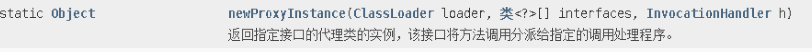

# AOP

### AOP概念

1. 面向切面编程，利用AOP可以对业务逻辑的各个部分进行隔离，从而使得业务逻辑各个部分之间的耦合度降低，提高代码的可重用性，同时统计高了开发的效率。
2. 通俗描述：不通过修改源代码的方式，在主干功能里添加新功能


### 实现原理

1. AOP底层使用动态代理

   1. 有接口的情况下，使用JDK动态代理

      创建接口实现类的代理对象，通过代理对象增强类的方法

   2. 没有接口的情况下，使用CGLIB动态代理

      创建子类的代理对象，通过代理对象增强类的方法


### AOP(JDK动态代理)

1. JDK动态代理，使用Proxy类里面的方法创建代理对象

   - 调用newProxyInstance方法：

     

   - 方法参数说明：

     1. 类加载器
     2. 增强方法所在的类，这个类实现的接口，支持多个接口。
     3. 实现这个接口InvocationHandler，创建代理对象，写增强的部分。

2. 编写JDK动态代理的代码

   1. 创建接口，定义方法

      ```java
      public interface UserDao {
          public int add(int a, int b);
          public String update(String id);
      }
      ```

   2. 创建接口实现类，实现方法

      ```java
      public class UserDaoImpl implements UserDao{
          @Override
          public int add(int a, int b) {
              return a+b;
          }
      
          @Override
          public String update(String id) {
              return id;
          }
      }
      ```

   3. 使用Proxy类创建接口代理对象

      ```java
      public class JdkProxy {
          public static void main(String[] args) {
              //创建接口实现类代理对象
              Class[] interfaces = {UserDao.class};
              UserDaoImpl userDao = new UserDaoImpl();
              UserDao dao = (UserDao)Proxy.newProxyInstance(JdkProxy.class.getClassLoader(), interfaces, new UserDaoProxy(userDao));
              int result = dao.add(1, 2);
              System.out.println("result = " + result);
          }
      }
      
      //创建代理对象代码
      class UserDaoProxy implements InvocationHandler {
          //传入代理对象
          private Object obj;
          public UserDaoProxy(Object obj) {
              this.obj = obj;
          }
      
          //增强逻辑
          @Override
          public Object invoke(Object proxy, Method method, Object[] args) throws Throwable {
              //方法之前
              System.out.println("方法之前执行。。。" + method.getName() + " : 传递的参数。。。" + Arrays.toString(args));
              //执行原始的被增强的方法
              Object res = method.invoke(obj, args);
              //方法之后
              System.out.println("方法之后执行。。。" + res);
              return res;
          }
      }
      ```

      


### AOP(操作术语)


